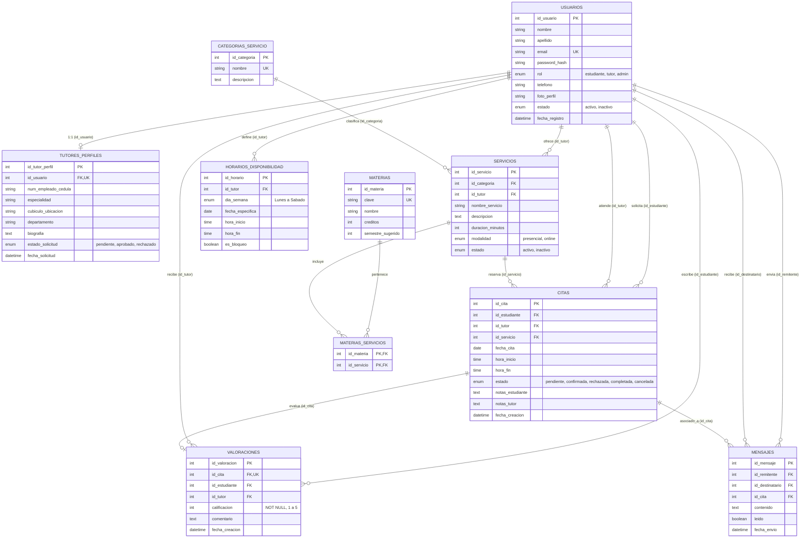

```mermaid
erDiagram
    USUARIOS ||--o| TUTORES_PERFILES : "1:1 (id_usuario)"
    USUARIOS ||--o{ SERVICIOS : "ofrece (id_tutor)"
    USUARIOS ||--o{ HORARIOS_DISPONIBILIDAD : "define (id_tutor)"
    USUARIOS ||--o{ CITAS : "solicita (id_estudiante)"
    USUARIOS ||--o{ CITAS : "atiende (id_tutor)"
    USUARIOS ||--o{ VALORACIONES : "escribe (id_estudiante)"
    USUARIOS ||--o{ VALORACIONES : "recibe (id_tutor)"
    USUARIOS ||--o{ MENSAJES : "envia (id_remitente)"
    USUARIOS ||--o{ MENSAJES : "recibe (id_destinatario)"

    CATEGORIAS_SERVICIO ||--o{ SERVICIOS : "clasifica (id_categoria)"
    MATERIAS ||--o{ MATERIAS_SERVICIOS : "pertenece"
    SERVICIOS ||--o{ MATERIAS_SERVICIOS : "incluye"
    SERVICIOS ||--o{ CITAS : "reserva (id_servicio)"
    CITAS ||--o| VALORACIONES : "evalua (id_cita)"
    CITAS ||--o{ MENSAJES : "asociado_a (id_cita)"

    USUARIOS {
        int id_usuario PK
        string nombre
        string apellido
        string email UK
        string password_hash
        enum rol "estudiante, tutor, admin"
        string telefono
        string foto_perfil
        enum estado "activo, inactivo"
        datetime fecha_registro
    }

    TUTORES_PERFILES {
        int id_tutor_perfil PK
        int id_usuario FK, UK
        string num_empleado_cedula
        string especialidad
        string cubiculo_ubicacion
        string departamento
        text biografia
        enum estado_solicitud "pendiente, aprobado, rechazado"
        datetime fecha_solicitud
    }

    CATEGORIAS_SERVICIO {
        int id_categoria PK
        string nombre UK
        text descripcion
    }

    MATERIAS {
        int id_materia PK
        string clave UK
        string nombre
        int creditos
        int semestre_sugerido
    }

    SERVICIOS {
        int id_servicio PK
        int id_categoria FK
        int id_tutor FK
        string nombre_servicio
        text descripcion
        int duracion_minutos
        enum modalidad "presencial, online"
        enum estado "activo, inactivo"
    }

    MATERIAS_SERVICIOS {
        int id_materia PK, FK
        int id_servicio PK, FK
    }

    HORARIOS_DISPONIBILIDAD {
        int id_horario PK
        int id_tutor FK
        enum dia_semana "Lunes a Sabado"
        date fecha_especifica
        time hora_inicio
        time hora_fin
        boolean es_bloqueo
    }

    CITAS {
        int id_cita PK
        int id_estudiante FK
        int id_tutor FK
        int id_servicio FK
        date fecha_cita
        time hora_inicio
        time hora_fin
        enum estado "pendiente, confirmada, rechazada, completada, cancelada"
        text notas_estudiante
        text notas_tutor
        datetime fecha_creacion
    }

    VALORACIONES {
        int id_valoracion PK
        int id_cita FK, UK
        int id_estudiante FK
        int id_tutor FK
        int calificacion "NOT NULL, 1 a 5"
        text comentario
        datetime fecha_creacion
    }

    MENSAJES {
        int id_mensaje PK
        int id_remitente FK
        int id_destinatario FK
        int id_cita FK
        text contenido
        boolean leido
        datetime fecha_envio
    }
```
